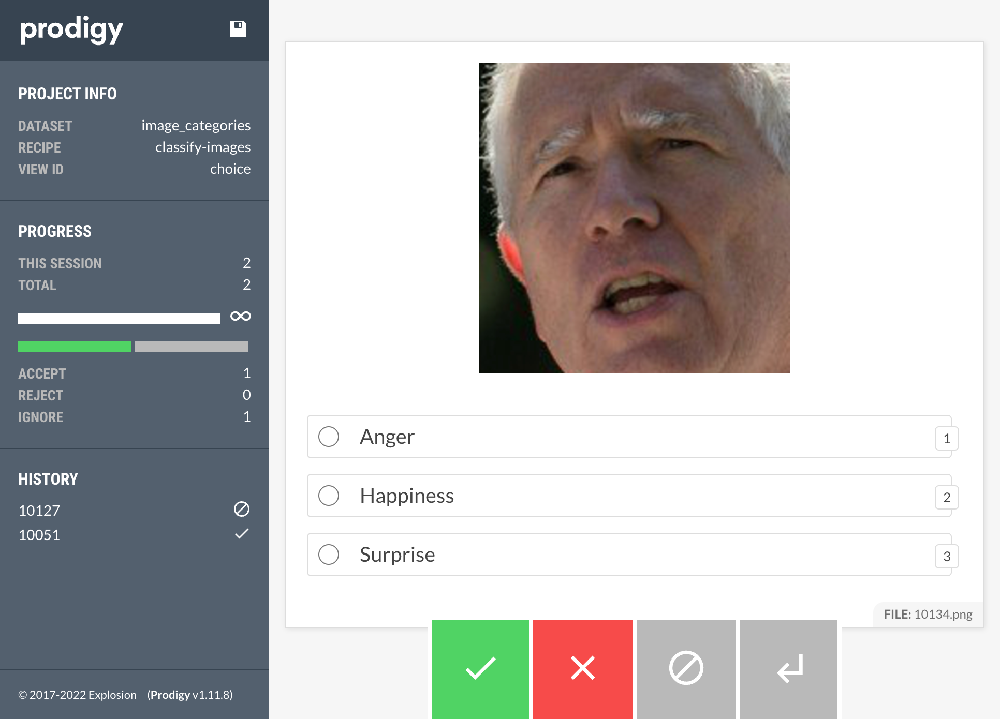
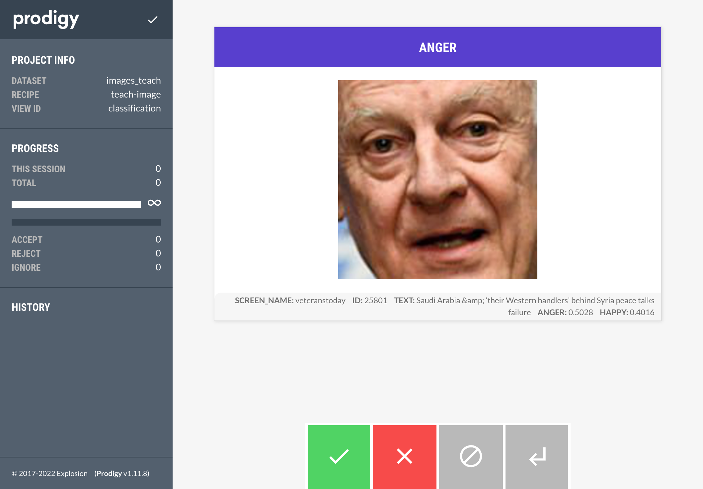

# Prodigy Facial Images Labeling

## Prodigy

### Binary classification of Anger


```bash
#make binary_anger
python -m prodigy mark binary_anger ./data/rq1 --loader images --label ANGER --view-id classification
```

### Categorization of Anger, Happiness, Surprise



```bash
#make classify_images
python -m prodigy classify-images image_categories ./images -F scripts/classify_images.py
```

### Active Learning



```bash
#make teach_image
python -m prodigy teach_image images_teach data/anger_teach.jsonl -F scripts/teach_image.py
```

### A/B Captcha


Before running, you need to run this command once to convert the images to base64 images and convert to `.jsonl` format.

```bash
#make ab_captcha_preprocess
python scripts/convert.py data/rq2data.csv data/ab_captcha.jsonl
```

After you have created `ab_captcha.jsonl`, you can now run the recipe:

```bash
#make ab_captcha
python -m prodigy ab_captcha images data/ab_captcha.jsonl -F scripts/ab_captcha.py
```

## ⏩ Getting started

It is highly recommended to create a new virtual environment before starting. 

```bash
python -m venv .env
source .env/bin/activate
```

When you have a fresh environment, run the following commands from the root repo directory:

```bash
python -m pip install --upgrade pip
pip install -r requirements.txt
```

## Prodigy Setup

There is also a `requirements-prodigy.txt` file, _not included in this repo_, for installing Prodigy. The file is only:

```txt
--extra-index-url https://XXXX-XXXX-XXXX-XXXX@download.prodi.gy/index 
prodigy>=1.11.0,<2.0.0
```

Where your product key is substituted for `XXXX-XXXX-XXXX-XXXX`. You can then use this to install prodigy, if you need to label data, with `pip install -r requirements-prodigy.txt`

## Downloading the data

```bash
make download
```

The data was from [Karduni et al., 2021](https://arxiv.org/pdf/2102.13167.pdf) obtained via Twitter's API. 

```
@article{karduni2021images,
  title={Images, Emotions, and Credibility: Effect of Emotional Facial Images on Perceptions of News Content Bias and Source Credibility in Social Media},
  author={Karduni, Alireza and Wesslen, Ryan and Markant, Douglas and Dou, Wenwen},
  journal={arXiv preprint arXiv:2102.13167},
  year={2021}
}
```